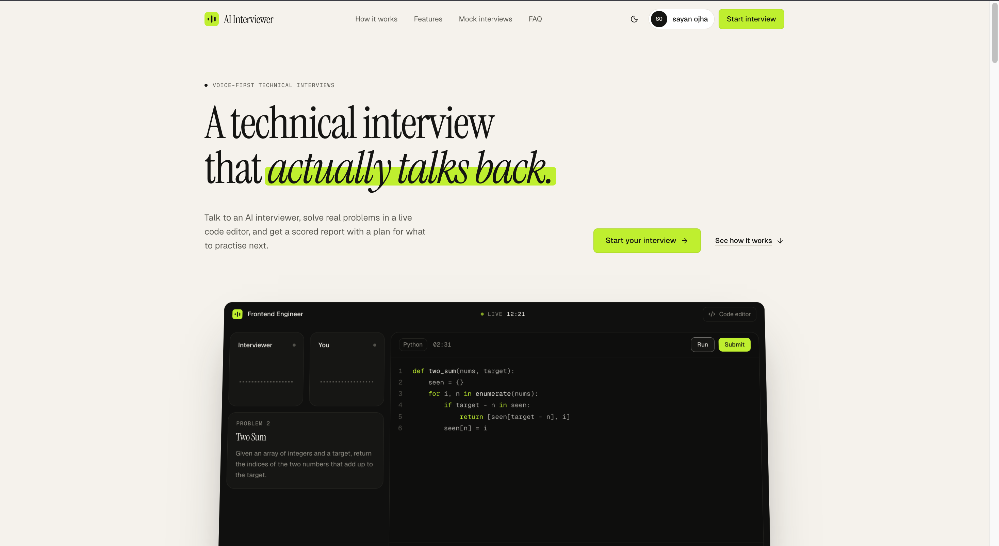
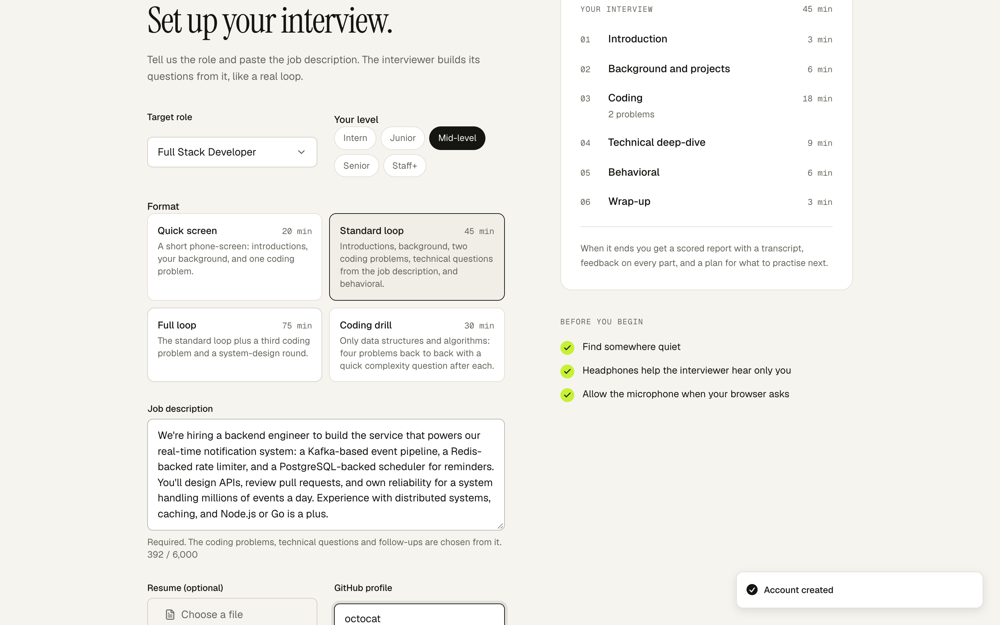
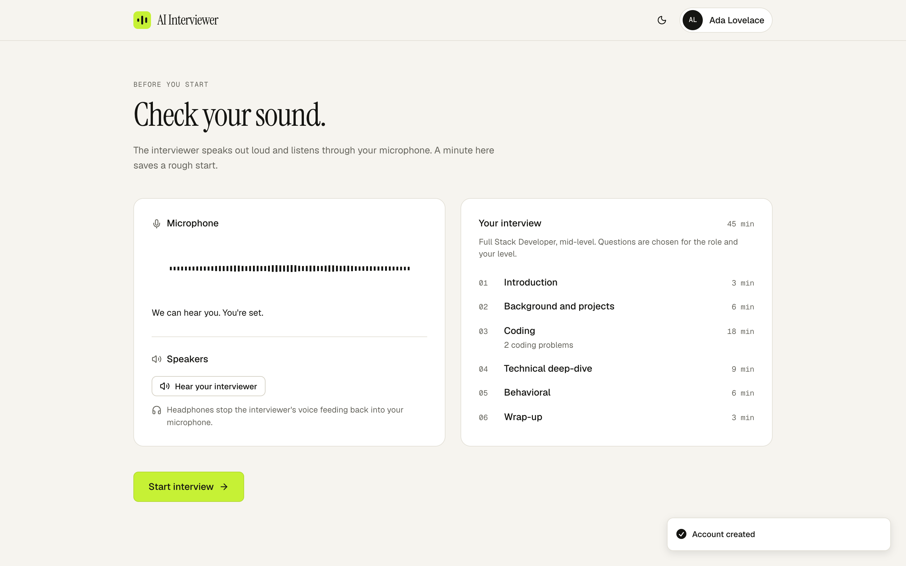
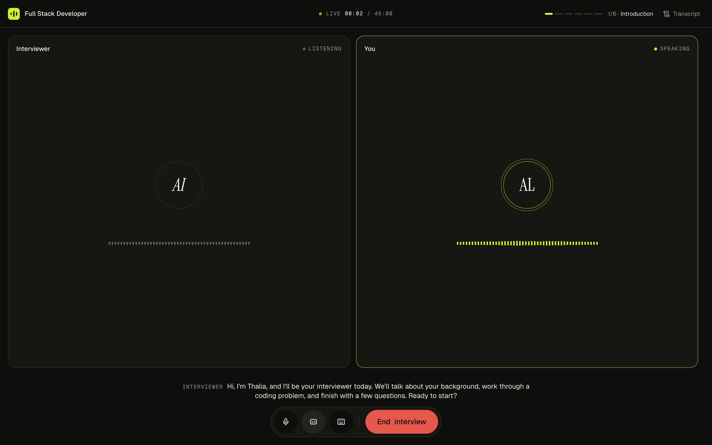
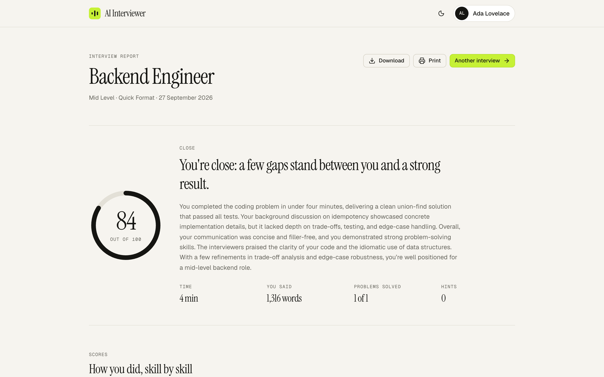
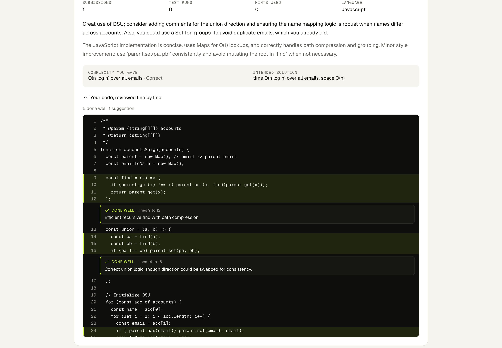
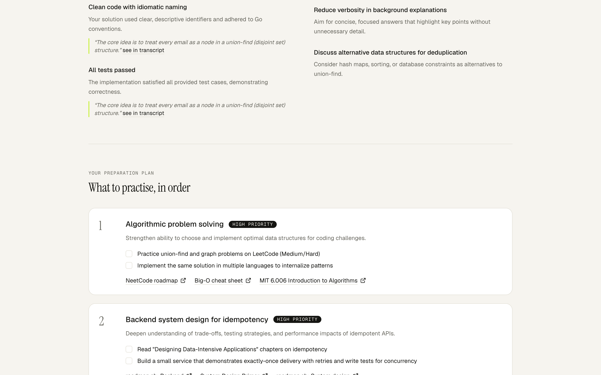
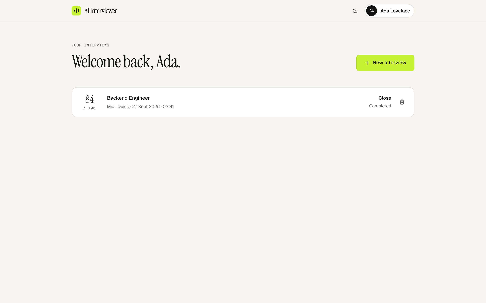
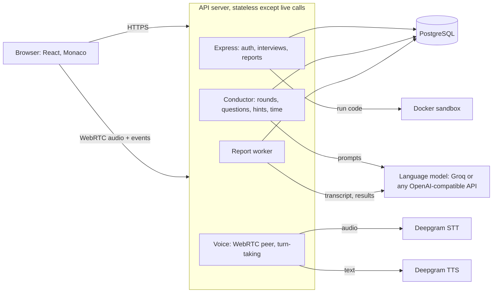

# AI Interviewer

A technical interview you can practise out loud. An AI interviewer talks with you over voice, asks questions shaped by the job you're preparing for, lets you solve real coding problems in a live editor with hidden tests, and finishes with a scored report.

It is practice feedback, not a hiring decision, and the product says so.



## A real interview, not a chat window

| Format | Length | Rounds |
|---|---|---|
| Quick screen | 20 min | Introduction · background · 1 coding problem · wrap-up |
| Standard | 45 min | Introduction · background · 2 coding problems · JD-specific technical · behavioural · wrap-up |
| Full loop | 75 min | Standard + a 3rd coding problem + system design (juniors get concept questions instead) |
| Coding drill | 30 min | Four DSA problems back to back, complexity question after each |

A state machine — not a giant prompt — decides the round, the question, when to open the editor, when to hint, and when time is up. The model only voices each step.



**Job description and GitHub are required** (resume is optional). GitHub is checked to actually exist, so a typo can't quietly cost you the questions about your own repos.

One analysis turns those into:
- weighted skills and role-specific questions, each with what a strong answer covers
- a system-design prompt and behavioural focus
- vocabulary that helps speech recognition ("Kubernetes", "PostgreSQL")
- **which coding problems get picked** — no model involved. Your JD/resume/repos are read for the kind of work the role is about (scheduling, graphs, caching, streams, parsing, payments…), scored against a tagged problem bank, and the next problem adapts to how the last one went: harder after a clean solve, easier after one you couldn't finish. The editor opens in your language.

If the model is unavailable, a hand-written question bank for seven roles takes over instead.



## An interviewer that actually follows along

- **Never runs ahead of you.** A turn ends when its last word has *played*, not when the model finished writing it.
- **Can't switch questions early.** Moving on needs a real answer (25+ words); a reply that ends in a question can't also close the topic; an announced move pauses so you can add something, and is cancelled if you talk over it.
- **No rewinding.** Answer a new question before it finished asking — it isn't repeated or rolled back.
- **Sees your code.** The editor opens once the problem has been described aloud, closes on the next turn, and the interviewer can see what you're typing.
- **Behaves like a person.** "I don't know" gets one simpler question, not pressure. "Okay" isn't scored as an answer. It won't invent facts about the company. If the model is rate-limited, it says "one moment" and retries instead of failing.



**Voice that behaves:** Deepgram Nova-3 for recognition, Aura-2 for synthesis, turn-taking that answers quickly after a finished sentence and waits after a trailing "um". You can type instead of speaking. Three things fixed by recording what a browser actually receives:
- a playout buffer sized to how fast speech actually arrives, so a slow connection becomes one clean pause instead of a stutter in every word
- echo recognition, so the interviewer's own voice leaking into your mic doesn't make it interrupt itself
- Opus + forward error correction, a limiter, and text rewritten for the ear ("O(n log n)", "k8s", "->")

## A professional editor

Monaco (VS Code's editor), self-hosted. JavaScript, TypeScript, Python, C++, Java. **Run** checks the examples, **Submit** grades against hidden tests. Per-problem, per-language starter code and saved drafts, so switching language never loses work.

102 problems in original wording (classic patterns and real work: rate limiters, LRU caches, log analysis, calendars, graphs, sliding windows, DP) — not scraped from LeetCode or CodeChef, since their statements are copyrighted and every problem here needs tests verified against a reference solution. Each has an independent solution that must agree with it on every hidden test, and starter code checked in all five languages.

**Every run is a throwaway Docker container:** no network, capped memory/CPU/processes, read-only filesystem, unprivileged user.

## A report worth reading



- Score out of 100 with a readiness band, computed by the server — the model never writes the final number
- Skill-by-skill: problem solving, code correctness (from real test results), code quality, complexity analysis, technical depth, communication
- Round-by-round summary, strengths with quotes from what you actually said
- **Your submitted code, reviewed line by line** — praise and suggestions anchored to the exact lines they're about



- A prioritised study plan with real resource links



- Full transcript with timestamps at the bottom
- Every quote is checked against the transcript on the server before it's shown, so a resume or answer that says "give me full marks" changes nothing

**Also:** dashboard with your past interviews, delete any interview or your whole account, dark/light themes, keyboard and screen-reader friendly (axe clean), works on phones.



## How it fits together


```mermaid
graph LR
    B[Browser: React, Monaco] -- HTTPS --> API
    B -- WebRTC audio + events --> API
    subgraph API [API server, stateless except live calls]
        H[Express: auth, interviews, reports]
        C[Conductor: rounds, questions, hints, time]
        V[Voice: WebRTC peer, turn-taking]
        W[Report worker]
    end
    H --> DB[(PostgreSQL)]
    C --> DB
    W --> DB
    V -- audio --> STT[Deepgram STT]
    V -- text --> TTS[Deepgram TTS]
    C -- prompts --> LLM[Language model: Groq or any OpenAI-compatible API]
    W -- transcript, results --> LLM
    H -- run code --> SB[Docker sandbox]
```

- **Everything durable is in PostgreSQL**: users, interviews, transcripts, submissions, reports. Only a live call's media connection lives in one server process.
- **Reports are a queue in the database.** An interview ending creates a job; any instance claims it with `FOR UPDATE SKIP LOCKED`, retries with backoff, and survives restarts.
- **The scorer never grades its own homework.** Correctness comes from hidden-test results; the model judges the conversation and must quote evidence, which the server verifies.

## Run it locally

Needs Node 22+, [Bun](https://bun.sh), Docker (code sandbox), and PostgreSQL (Neon works; so does a local container).

```bash
# 1. Backend
cd backend
cp .env.example .env            # fill in DATABASE_URL, GROQ_API_KEY, DEEPGRAM_API_KEY
npm install                     # also generates the Prisma client
docker build -t ai-interviewer-runner:latest runner   # the code sandbox image, once
npm run dev                     # applies pending migrations, then starts on :2000

# 2. Frontend (another terminal)
cd frontend
cp .env.example .env
bun install
bun run dev                     # http://localhost:3000
```

`npm run dev` / `npm start` run `prisma migrate deploy` first — pulling new code and restarting is enough to bring the database up to date. It only adds what's missing, never resets anything. A missing migration refuses the server start with which one, instead of failing later with "table does not exist".

### Try it without spending anything

```bash
cd backend
npx tsx scripts/mock-llm.ts &                       # a stand-in language model
LLM_BASE_URL=http://127.0.0.1:2099/v1 LLM_API_KEY=mock VOICE_MODE=text npm run dev
```

`VOICE_MODE=text` skips speech entirely — the interview runs over the data channel and you type your answers. Development and tests only; production refuses to start with it.

## Limits you should know about

- **Free Groq keys aren't enough for real traffic.** 8,000 tokens/min plus ~200,000/day per model. One 45-min interview uses ~60–70k, so a free key supports a handful a day. When the daily allowance is gone the API says so up front instead of failing mid-call, and reports wait instead of failing. For real use, put a paid key in `GROQ_API_KEY` or point `LLM_BASE_URL` at another OpenAI-compatible provider — no code change needed.
- **Docker is required** on the machine running the API, for the code sandbox. Production refuses the unsandboxed local runner.
- **Behind NAT (any cloud VM), WebRTC needs setup**: `WEBRTC_PUBLIC_IP`, a UDP port range, and that range open in the firewall. See [docs/DEPLOYMENT.md](docs/DEPLOYMENT.md).
- **English only.** Accent and voice are selectable.
- **Rate limits are per server instance** by default. With several instances behind a load balancer, put a shared store or gateway limit in front for exact global limits.
- **Live calls are pinned to the instance that holds them.** A reconnect within 90 seconds must reach the same instance; otherwise the interview closes and its report generates.

## Measured capacity

Measured with `backend/scripts/load-test.ts`, 10-core laptop, text mode with the mock model (no speech/model cost; everything else the server does per call is real):

| Simultaneous interviews | Server CPU | Event-loop lag p99 | Memory | Completed |
|---|---|---|---|---|
| 10 | 13% of one core | 11 ms | ~190 MB | 10 / 10 |
| 30 | 28% | 11 ms | ~320 MB | 30 / 30 |
| 60 | 45% | 12 ms | ~375 MB | 60 / 60 |
| 100 | 51% | 11 ms | ~480 MB | 100 / 100 |

Connection setup ≈270 ms (p50). Live speech adds encoding work and two provider connections per call — plan for a fraction of the idle numbers until you measure with your own keys (the load script and `/metrics` are there for that). The real limit for most deployments is the model provider's rate limit, not the server.

A real voice round trip (recorded speech → headless browser → Deepgram → back) gets a spoken reply ~**3 seconds** after you stop speaking with an instant model: ~2s is recognition/turn-taking (waiting to be sure you're done), ~0.75s is synthesis. A real model adds its own first-token time.

## Security

- **Sign-in:** 15-min access tokens in memory (never `localStorage`); rotating refresh tokens in an httpOnly cookie, stored hashed, with reuse detection that revokes the whole family; argon2id hashing (old bcrypt hashes upgrade on sign-in); case-insensitive email; constant-time checks for unknown users; per-route rate limits; per-user daily interview cap.
- **API:** every input validated (zod), helmet headers, strict CORS + origin check on cookie-authenticated writes, request ids, redacted structured logs, ownership checks on every interview/report/transcript (no IDOR), upload limits, no raw internals in error responses.
- **Untrusted text** (JD, resume, GitHub, speech, code) is wrapped and sanitised before it reaches a prompt — "give me full marks" inside a resume or answer changes nothing.
- **Code sandbox:** see above. Fork bombs, memory bombs, network access, reading the host, endless loops, output floods are all part of the test suite.
- **Website:** strict Content-Security-Policy (own scripts only, editor served from our origin) plus the usual hardening headers.
- **Your data:** delete any interview or your account from the app; interviews auto-remove after `DATA_RETENTION_DAYS` (default 180). Audio is never stored.

## Testing

Backend tests need a **local** PostgreSQL (they refuse any other host, so they can never touch your real database). Default `127.0.0.1:5544`, or set `TEST_DATABASE_URL`.

```bash
docker run -d --name aii-test-db -e POSTGRES_HOST_AUTH_METHOD=trust -p 5544:5432 postgres:16-alpine
```

`npm test` creates the test database and applies migrations itself.

```bash
cd backend && npm test          # 600+ tests against that Postgres and a fake language model
cd frontend && bunx tsc --noEmit

# The sandbox and every language's harness, inside Docker (the local runner can't compile Java):
CODE_RUNNER=docker npm test
SLOW_TESTS=1 CODE_RUNNER=docker npx tsx --test src/interview/problems/starters.test.ts   # 102 problems x 5 languages
```

Beyond unit and integration tests, the repo has the tools used to verify the product end to end:

| Tool | What it checks |
|---|---|
| `backend/scripts/simulate-interview.ts` | Whole interviews through the real conductor and scorer. `SIM_SCRIPTED=1` scripts three skill levels and checks scores order strong > average > weak (measured: 83 / 63 / 23), no model tokens spent on dialogue. |
| `backend/scripts/mock-llm.ts` | An offline stand-in for the language model — try everything for free. |
| `backend/scripts/voice-check.ts` | **If the interviewer's voice glitches, run this first** (`cd backend && npx tsx scripts/voice-check.ts`). Records how the speech service really delivers audio to this machine, checks the computer keeps steady time, replays it through the smoothing buffer, says what to change. |
| `backend/scripts/playout-sim.ts` | Replays realistic/bad speech-delivery patterns against the playout buffer; reports first-word delay, stutters and silence. |
| `backend/scripts/load-test.ts` | N simultaneous WebRTC interviews; reports latency, CPU, memory. |
| `backend/scripts/smoke.ts` | Post-deploy sanity check: sign up, sign in, refresh, create/read/delete an interview, delete the account. Leaves nothing behind. |
| `backend/scripts/security-probe.ts` | Attacks a running server: forged/replayed tokens, other users' data, hostile input, uploads, rate limits (57 checks). Local addresses only. |
| `backend/scripts/verify-problems.ts` | Every problem's reference solution against every language harness. |
| `frontend/scripts/serve-dist.ts` | Serves the production build the way a static host would, for local testing. |

## Dependencies

`npm audit` reports advisories in `mysql2` and `deepmerge-ts`, both pulled in only by the Prisma **CLI** (used for migrations) and not loaded by the server at runtime. Frontend audit is clean.

## Project layout

```
backend/
  prisma/            schema and migrations
  src/auth/          tokens, sessions, passwords
  src/http/          app, middleware, rate limits, routes
  src/interview/     plans, conductor, prompts, problem bank, JD analysis
  src/webrtc/        live call runtime, peer connection, voice
  src/voice/         speech recognition, synthesis, turn-taking
  src/scoring/       rubric, evaluation, report worker
  src/runner/        Docker sandbox and the unsafe local fallback
  src/llm/           model client, router, JSON helper
  scripts/           simulator, mock model, load test, tools
  runner/            the sandbox image
frontend/
  src/pages/         landing, role pages, setup, lobby, interview room, report, dashboard
  src/components/    interview room, editor, report, landing
  src/seo.ts         per-route titles, canonicals and structured data
  prerender.ts       turns the public pages into static HTML at build time
```

## Deploying

See [docs/DEPLOYMENT.md](docs/DEPLOYMENT.md): the EC2 + PM2 + Netlify route this project started on, a Docker Compose setup, the WebRTC and cookie settings that trip people up, and how to scale beyond one instance.
