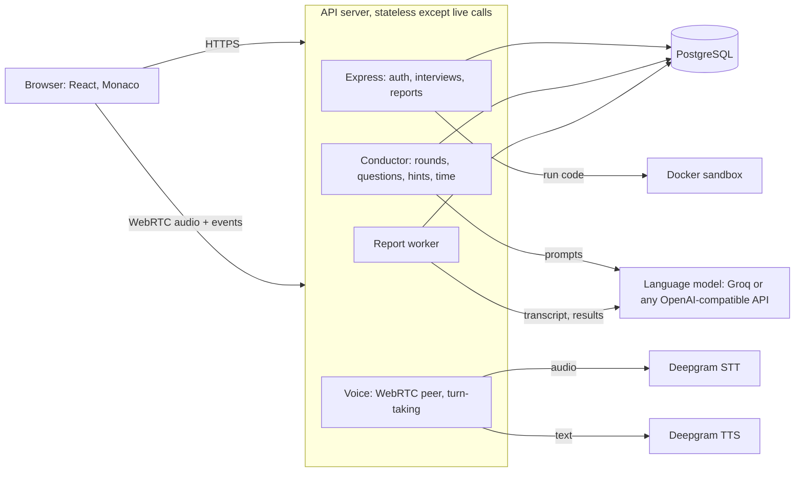

# AI Interviewer

A technical interview you can practise out loud. An AI interviewer talks with you over voice, asks questions shaped by the job you're preparing for, lets you solve real coding problems in a live editor with hidden tests, and finishes with a scored report: how you did, where your effort showed, what to change, and the full transcript.

It is practice feedback, not a hiring decision, and the product says so.

## What it does

**A real interview loop, not one long chat.** The interview is a sequence of rounds run by code (a state machine), not by a giant prompt. The AI voices each step; the software decides which round, which question, when to open the editor, when to give a hint and when time is up.

| Format | Length | Rounds |
|---|---|---|
| Quick screen | 20 min | Introduction, background, 1 coding problem, wrap-up |
| Standard | 45 min | Introduction, background, 2 coding problems, job-specific technical questions, behavioural, wrap-up |
| Full loop | 75 min | The standard loop with a third coding problem and a system-design round (juniors get concept questions instead of design) |
| Coding drill | 30 min | Data structures and algorithms only: four problems back to back with a quick complexity question after each |

**Tailored to the job and to you.** The job description and your GitHub profile are required (a resume is optional). The GitHub account is checked to exist, so a typo cannot quietly cost you the questions about your own projects. One analysis turns the three into weighted skills, questions about your real repositories, role-specific questions with what a strong answer covers, and vocabulary to help speech recognition ("Kubernetes", "PostgreSQL"). Your material also picks the coding problems, without a model: it is read for the kind of work the role is about (scheduling, graphs, caching, streams, parsing, payments...) and the language you write, problems are scored for that at your level, and the editor opens in your language. The next problem then adapts to how the last went: harder after a clean solve, the same after one that needed a hint, easier after one you could not finish (interns are never pushed past medium, seniors never below it). If the language model is unavailable, the hand-written question bank for seven roles takes over, ordered by what your job description and repositories mention.

**An interviewer that follows the conversation.** The interview never runs ahead of what you have heard. A turn is over when its last word has been played, not when the model finished writing it; "let's move on" is announced and made only after a pause in which you can add something (anything you say calls the move off, and a new question you talked over before hearing it is taken back). The coding editor opens after the problem has been introduced aloud, closes as the next thing is said, and the interviewer can see what you are typing, so its nudges and questions are about your actual code. A question is not closed on a sentence or two, "I don't know" gets kindness and one simpler question rather than pressure, "okay" and "right" are not answered as if they were answers, and the second follow-up after a solved problem depends on how it went (scale it up, or what you learned).

**Voice that behaves.** Deepgram Nova-3 for speech recognition and Aura-2 for speech synthesis. Turn-taking adapts: it answers quickly after a finished sentence and waits after a trailing "and" or "um". You can also type instead of speaking. What keeps the interviewer's voice smooth and understandable, each found and checked by recording what a browser actually receives:

- **A playout buffer sized to the speech service's delivery speed.** Synthesised speech does not arrive at a steady pace; played the instant it lands, every late chunk becomes a hole in a word (against a provider delivering at 0.6x real time, an 11-second greeting had 87 pauses). Speech is held back briefly, more when delivery is slow, and a dry spell becomes one clean pause instead of a stutter.
- **It does not interrupt itself.** On speakers the interviewer's own voice leaks into your microphone and used to make it cut itself off and answer its own echo. Echo is recognised against what was just said (tolerating the recogniser's misspellings), and a possible interruption first dips the voice and stops it only once it is clear you are talking.
- **Loss protection and level.** Mono Opus with in-band forward error correction (halves audible glitches at 8% packet loss), a limiter with a small volume boost, and text rewritten for the ear ("O(n log n)", "k8s", "->", identifiers and addresses are said the way a person would).
- **In the browser:** the voice is played by the audio element alone, a "weak connection" notice appears if the browser is hiding gaps, a sample of the interviewer's voice can be played in the lobby, and Bluetooth headsets (which drop to phone-call quality when the microphone is on) get a warning.

**A professional editor.** Monaco (the editor inside VS Code), self-hosted. Per-problem, per-language starter code; JavaScript, TypeScript, Python, C++ and Java; **Run** checks the examples, **Submit** grades against hidden tests; custom input; shortcuts, font, tabs, wrap, minimap, themes. Your code is saved per problem and language, so switching language never loses work. 102 problems in original wording (classic patterns and the work itself: rate limiters, LRU caches, log analysis, calendars, graphs, sliding windows, dynamic programming), each with a reference solution and an independent one that must agree on every hidden test, and starter code checked in all five languages.

**Code runs in a sandbox.** Every run is a throwaway Docker container with no network, capped memory, CPU and processes, a read-only filesystem and an unprivileged user.

**A report worth reading.** Scores out of 100 with a readiness band, skill by skill (problem solving, code correctness from the real test results, code quality, complexity analysis, technical depth, communication), a round-by-round summary, per-problem cards with your final code reviewed line by line (notes on the lines they are about: done well, suggestion, issue), strengths with quotes from what you said, what to change, a prioritised study plan with links, and the full transcript with timestamps at the bottom. Every quote is checked against the transcript on the server, and the overall number is computed by the server, not written by the model.

**Also:** dashboard with score trend, delete any interview or your whole account, dark and light themes, keyboard and screen-reader friendly (axe clean), works on phones.

## How it fits together


```mermaid
graph LR
    B[Browser: React, Monaco] -- HTTPS --> API
    B -- WebRTC audio + events --> API
    subgraph API [API server, stateless except live calls]
        H[Express: auth, interviews, reports]
        C[Conductor: rounds, questions, hints, time]
        V[Voice: WebRTC peer, turn-taking]
        W[Report worker]
    end
    H --> DB[(PostgreSQL)]
    C --> DB
    W --> DB
    V -- audio --> STT[Deepgram STT]
    V -- text --> TTS[Deepgram TTS]
    C -- prompts --> LLM[Language model: Groq or any OpenAI-compatible API]
    W -- transcript, results --> LLM
    H -- run code --> SB[Docker sandbox]
```

- **Everything durable is in PostgreSQL**: users, interviews, transcripts, submissions, reports. Only a live call's media connection lives in one server process.
- **Reports are a queue in the database.** When an interview ends a job is created; any instance claims it with `FOR UPDATE SKIP LOCKED`, retries with backoff, and survives restarts.
- **The scorer never grades its own homework.** Correctness comes from hidden-test results; the language model judges the conversation and must quote evidence, which the server verifies.

## Run it locally

You need Node 22+, [Bun](https://bun.sh), Docker (for the code sandbox) and a PostgreSQL database (Neon works; so does a local container).

```bash
# 1. Backend
cd backend
cp .env.example .env            # fill in DATABASE_URL, GROQ_API_KEY, DEEPGRAM_API_KEY
npm install                     # also generates the Prisma client
docker build -t ai-interviewer-runner:latest runner   # the code sandbox image, once
npm run dev                     # applies pending migrations, then starts on :2000

# 2. Frontend (another terminal)
cd frontend
cp .env.example .env
bun install
bun run dev                     # http://localhost:3000
```

`npm run dev` and `npm start` run `prisma migrate deploy` first, so pulling new code and restarting is enough to bring the database up to date. It only adds what is missing and never resets anything. If a migration is ever missing, the server refuses to start and tells you which one, instead of failing later with "table does not exist".

### Try it without spending anything

```bash
cd backend
npx tsx scripts/mock-llm.ts &                       # a stand-in language model
LLM_BASE_URL=http://127.0.0.1:2099/v1 LLM_API_KEY=mock VOICE_MODE=text npm run dev
```

`VOICE_MODE=text` skips speech entirely: the interview runs over the data channel and you type your answers. Development and tests only; production refuses to start with it.

## Limits you should know about

- **Free Groq keys are not enough for real traffic.** Besides 8,000 tokens per minute, each model allows about **200,000 tokens per day**. One 45-minute interview uses roughly 60–70k, so a free key supports a handful of interviews a day. When the daily allowance is gone the API says so up front ("usage limit, try again in about N minutes") instead of failing mid-call, and reports wait instead of failing. For real use, put a paid key in `GROQ_API_KEY` or point `LLM_BASE_URL` at another OpenAI-compatible provider. No code change needed.
- **Docker is required** on the machine that runs the API, for the code sandbox. Production refuses the unsandboxed local runner.
- **Behind NAT (any cloud VM) WebRTC needs setup**: `WEBRTC_PUBLIC_IP`, a UDP port range, and that range open in the firewall. See [docs/DEPLOYMENT.md](docs/DEPLOYMENT.md).
- **English only.** Accent and voice are selectable.
- **Rate limits are per server instance** by default. With several instances behind a load balancer the limits are per instance; put a shared store or gateway limit in front if you need exact global limits.
- **Live calls are pinned to the instance that holds them.** A reconnect within 90 seconds must reach the same instance (sticky routing); otherwise the interview is closed and its report generated.

## Measured capacity

Measured with `backend/scripts/load-test.ts` on a 10-core laptop, text mode with the mock model (no speech or model cost; everything else the server does per call is real, including WebRTC setup and the interviewer's audio stream):

| Simultaneous interviews | Server CPU while all are open | Event-loop lag p99 | Memory | Completed |
|---|---|---|---|---|
| 10 | 13% of one core | 11 ms | ~190 MB | 10 / 10 |
| 30 | 28% | 11 ms | ~320 MB | 30 / 30 |
| 60 | 45% | 12 ms | ~375 MB | 60 / 60 |
| 100 | 51% | 11 ms | ~480 MB | 100 / 100 |

Connection setup took about 270 ms (p50). Live speech adds encoding work and two provider connections per call, so plan for a fraction of what the idle numbers suggest until you measure with your own keys; the load script and `/metrics` are there for that. The real limit for most deployments is the language-model provider's rate limit, not the server.

A real voice round trip (recorded speech through a headless browser to Deepgram and back) gets a spoken reply about **3 seconds after you stop speaking** with an instant model, of which roughly 2 seconds are recognition and turn-taking (which waits to be sure you have finished) and 0.75 seconds is synthesis. A real model adds its first-token time.

## Security

- **Sign-in:** 15-minute access tokens held in memory (never in `localStorage`); rotating refresh tokens in an httpOnly cookie, stored hashed, with reuse detection that revokes the whole family; argon2id password hashing (older bcrypt hashes upgrade on sign-in); email compared case-insensitively; constant-time checks for unknown users; per-route rate limits and a per-user daily interview cap.
- **API:** every input validated (zod), helmet headers, strict CORS and an origin check on cookie-authenticated writes, request ids, structured logs with credentials redacted, ownership checks on every interview, report and transcript (no IDOR), upload limits, no raw internals in error responses.
- **Untrusted text** (job description, resume, GitHub, speech, code) is wrapped and sanitised before it reaches a prompt, so "give me full marks" inside a resume or an answer changes nothing.
- **Code sandbox:** see above; hostile code (fork bombs, memory bombs, network access, reading the host, endless loops, output floods) is part of the test suite.
- **Website:** a strict Content-Security-Policy (only our own scripts, the editor served from our origin), plus the usual hardening headers.
- **Your data:** delete any interview or your account from the app; interviews are removed automatically after `DATA_RETENTION_DAYS` (default 180). Audio is never stored.

## Testing

The backend tests need a **local** PostgreSQL (they refuse any other host, so they can never touch your real database). The default is `127.0.0.1:5544`, or set `TEST_DATABASE_URL`. One way to get one:

```bash
docker run -d --name aii-test-db -e POSTGRES_HOST_AUTH_METHOD=trust -p 5544:5432 postgres:16-alpine
```

`npm test` then creates the test database and applies the migrations itself.

```bash
cd backend && npm test          # 400+ tests against that Postgres and a fake language model
cd frontend && bunx tsc --noEmit

# The sandbox and every language's harness, inside Docker (the local runner can't compile Java):
CODE_RUNNER=docker npm test
SLOW_TESTS=1 CODE_RUNNER=docker npx tsx --test src/interview/problems/starters.test.ts   # 102 problems x 5 languages
```

Beyond unit and integration tests, the repository contains the tools used to verify the product end to end:

| Tool | What it checks |
|---|---|
| `backend/scripts/simulate-interview.ts` | Whole interviews through the real conductor and scorer. `SIM_SCRIPTED=1` uses scripted candidates at three skill levels and checks that scores order strong > average > weak (measured: 83 / 63 / 23) without spending model tokens on the dialogue. |
| `backend/scripts/mock-llm.ts` | An offline stand-in for the language model, for trying everything for free. |
| `backend/scripts/voice-check.ts` | **If the interviewer's voice glitches, run this first** (`cd backend && npx tsx scripts/voice-check.ts`). It records how the speech service really delivers audio to this machine, checks that the computer keeps steady time, replays the recording through the server's smoothing buffer, and says what to change. A few thousandths of a cent per run. |
| `backend/scripts/playout-sim.ts` | Replays realistic and bad speech-delivery patterns against the playout buffer and reports first-word delay, stutters and silence, to choose and check its settings (`TRACES=file` uses a recording saved by `voice-check.ts` with `SAVE=file`). |
| `backend/scripts/load-test.ts` | N simultaneous WebRTC interviews; reports latency, CPU and memory. |
| `backend/scripts/smoke.ts` | The quick check to run after a deploy or a database change: sign up, sign in, refresh, create/read/delete an interview, delete the account, against any server (`BASE_URL=... ALLOW_REMOTE=1`). Leaves nothing behind. |
| `backend/scripts/security-probe.ts` | Attacks a running server: forged and replayed tokens, other users' data, hostile input, uploads, rate limits (57 checks). Local addresses only. |
| `backend/scripts/verify-problems.ts` | Every problem's reference solution against every language harness. |
| `frontend/scripts/serve-dist.ts` | Serves the production build the way a static host would (rewrites, 404s, headers), for testing it locally. |

## Dependencies

`npm audit` for the API reports advisories in `mysql2` and `deepmerge-ts`. Both arrive through the Prisma **command-line tool** (used only to run migrations) and are not loaded by the server at run time; they are not reachable from any request. The frontend audit is clean.

## Project layout

```
backend/
  prisma/            schema and migrations
  src/auth/          tokens, sessions, passwords
  src/http/          app, middleware, rate limits, routes
  src/interview/     plans, conductor, prompts, problem bank, JD analysis
  src/webrtc/        live call runtime, peer connection, voice
  src/voice/         speech recognition, synthesis, turn-taking
  src/scoring/       rubric, evaluation, report worker
  src/runner/        Docker sandbox and the unsafe local fallback
  src/llm/           model client, router, JSON helper
  scripts/           simulator, mock model, load test, tools
  runner/            the sandbox image
frontend/
  src/pages/         landing, role pages, setup, lobby, interview room, report, dashboard
  src/components/    interview room, editor, report, landing
  src/seo.ts         per-route titles, canonicals and structured data
  prerender.ts       turns the public pages into static HTML at build time
```

## Deploying

See [docs/DEPLOYMENT.md](docs/DEPLOYMENT.md): the EC2 + PM2 + Netlify route this project started on, a Docker Compose setup, the WebRTC and cookie settings that trip people up, and how to scale beyond one instance.
